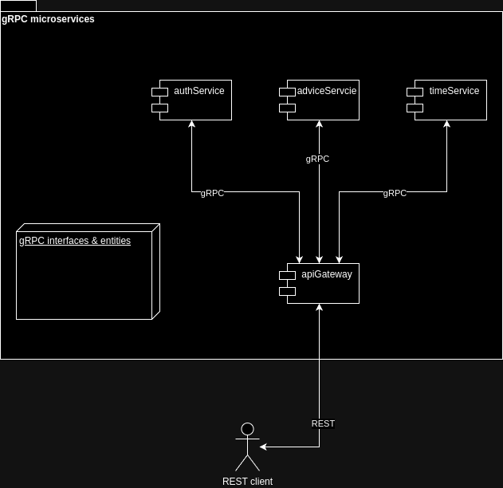

# Модуль 7. Архитектура ПО
## 7.5. Практическое задание: проектирование микросервисной архитектуры

### Что нужно делать

Разработайте и разверните архитектуру для выбранной вами системы или приложения, состоящую из нескольких микросервисов, 
использующих gRPC для взаимодействия. Вы должны выделить микросервисы, настроить их взаимодействие, 
развернуть инфраструктуру с помощью Docker и Docker Compose, а также протестировать взаимодействие между сервисами.

### Описание реализации

Приложение состоит из нескольких модулей и имеет следующую структуру:

* interface-grpc - модуль для генерации классов и интерфейсов
* serviceAuth - gRPC сервис, проверяет имя пользователя и возвращает статус проверки
* serviceAdvice - gRPC сервис, возвращает строку
* serviceTime - gRPC сервис, возвращает актуальное время
* apiGatewayService - REST сервис, является клиентом для трех gRPC сервисов и получает от них ответы и перекладывает в свой ответ

Все микросервисы оборачивабтся в контейнеры и запускаются при помощи Docker и Docker Compose
Также добавлен контейнер с grpcurl для отладки контейнеров